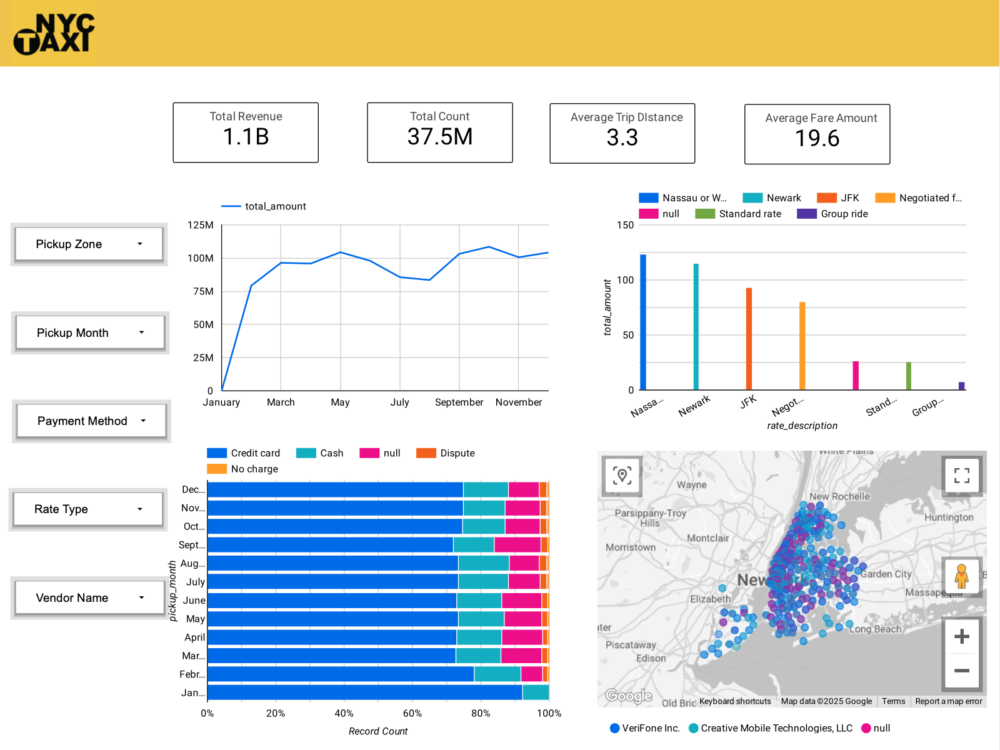

# GCP-NYC-Yellow-Taxi-Analytics-Project
## Introduction
This project leverages Google Cloud Platform (GCP) to process and analyze data efficiently. It focuses on analyzing 2024 New York Yellow Taxi data stored in Google Cloud Storage (GCS), while Google Compute Engine (GCE) virtual machines facilitate ETL processes using Mage. A structured data warehouse is designed based on data characteristics, utilizing BigQuery for analysis and generating analytical tables. Interactive and insightful reports are then created using Looker, enabling data-driven decision-making.

## Architecture

## Technology Used
* Google Cloud Storage (GCS) – Data storage and management
* Mage – ETL (Extract, Transform, Load) processing
* Google Compute Engine (GCE) – Virtual machine instances for computing tasks
* BigQuery – Data warehouse for large-scale data processing and analytics
* Looker – Business intelligence and interactive dashboarding
  
## Looker Dashboard

This project analyzes NYC TLC Trip Data to provide insights into ride frequency, trip duration, fare trends, and geographic distribution, supporting NYC yellow taxi mobility and business intelligence.

## Future Enhancements
This project aims to extract meaningful insights from taxi ride patterns, enabling data-driven decision-making. Future iterations will incorporate more years and additional taxi types for a comprehensive comparative analysis.

## Dataset Used
Here is the dataset link: https://www.nyc.gov/site/tlc/about/tlc-trip-record-data.page
