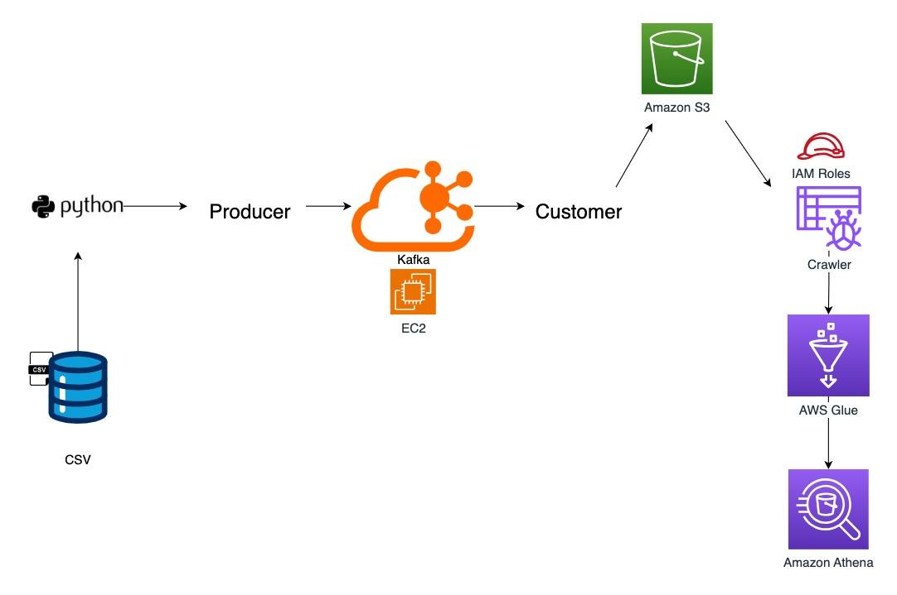

# Real-Time Stock Market Data Analytics | Using Kafka
## Introduction
This project demonstrates a real-time stock market data analysis pipeline using Apache Kafka, AWS EC2, and Python for data ingestion and processing. The processed data is stored in S3, catalogued with AWS Glue Crawler, and queried using Amazon Athena for real-time insights. This project showcases expertise in streaming data pipelines and AWS analytics services.

## Architecture

## Technology Used
1. Programming Language - Python
2. Scripting Language - SQL
3. Apache Kafka
4. AWS Cloud Platform
   - EC2
   - Athena
   - S3 bucket
   - Glue Crawler

## Dataset Used
This dataset contains historical stock market data for the HSI (Hang Seng Index), including fields such as the date, open, high, low, close, adjusted close, and volume. Additionally, it includes the closing price in USD for better international comparison.

Here is the dataset link:  https://github.com/yuxuchen/Data-Engineering-Portfolio-Iris/blob/main/Real-Time-Kafka-Data-Engineering-Project/indexProcessed.csv
